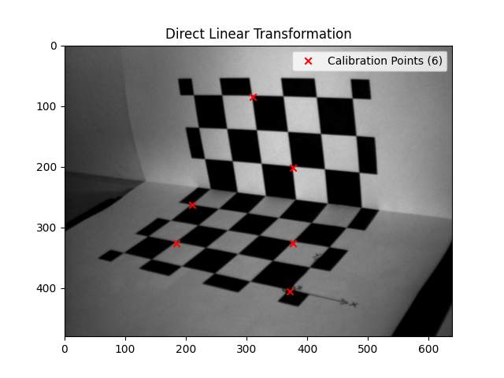

# Direct Linear Transformation (DLT)
## How it Works
| Calibration Points | Prediction |
|--------------------|------------|
|  |  |- 
- **Left Image:** Shows the selected calibration points in the world coordinate system.
- **Right Image:** Shows the predicted 2D points for both calibration and test points after applying the Direct Linear Transformation (DLT) method.

## Goal

The objective of this project is to implement the Direct Linear Transformation (DLT) algorithm for camera calibration, specifically to estimate the projection matrix that transforms 3D world coordinates into 2D image coordinates. This technique is essential for computer vision tasks that involve 3D object positioning, camera calibration, and scene reconstruction.

By using known 3D world coordinates (reference points) and their corresponding 2D image coordinates, the DLT algorithm is used to calculate the transformation matrix that can later be used for projecting any 3D world points into the 2D image plane.

---

## Challenges

1. **Data Preprocessing**:
   - Ensuring accurate alignment of 3D world coordinates with their corresponding 2D image coordinates.
   - Splitting the data into training and test sets for model evaluation and ensuring consistency during training.

2. **Matrix Construction**:
   - Efficiently constructing the required matrices (Au, Av) for the DLT system.
   - Handling the complex nature of the system of linear equations involved in the DLT algorithm.

3. **Accuracy and Optimization**:
   - Handling real-world inaccuracies in 3D to 2D projection, such as noise in the coordinates.
   - Fine-tuning the method to achieve optimal calibration results, especially for unseen test data.

4. **Visualization**:
   - Properly visualizing the estimated projection points on the image and comparing them with the ground truth.
   - Ensuring the correct display of the training, testing, and predicted points in a clear and interpretable way.

---

## Methodology

1. **Data Input**:
   - 3D world coordinates (`x`, `y`, `z`) and their corresponding 2D image coordinates (`u`, `v`) are provided as input.
   - The data is split into training and testing sets, with the training data used for model fitting and the testing data used for validation.

2. **Matrix Construction**:
   - The DLT algorithm involves constructing two matrices, `Au` and `Av`, for the `u` and `v` image coordinates respectively.
   - The matrix construction is done by stacking the 3D world coordinates and their projections into a suitable form for the least squares solution.

3. **Least Squares Solution**:
   - The projection matrix `L` is computed using the least squares method, which minimizes the error between the observed 2D image points and the estimated 2D points.

4. **Prediction**:
   - Once the projection matrix `L` is computed, the model is used to predict the 2D coordinates for the test set.
   - These predictions are then compared with the actual values to evaluate the model's performance.

5. **Visualization**:
   - The results are visualized by plotting the original 2D image, overlaying the calibration points (training and test points), and showing the predicted 2D points.

7. **Camera Parameters**: After obtaining the projection matrix **L**, the intrinsic and extrinsic camera parameters are computed.

   - **Intrinsic Parameters**:
     - Derived from the DLT matrix **L** using geometric relationships.
     - Includes:
       - `u₀`, `v₀`: Coordinates of the **principal point** in the image.
       - `bₓ`, `bᵧ`: **Camera constants** (related to focal length and pixel scaling in x and y directions).
       - `Lconst`: A normalization constant derived from the last three elements of **L**.

   - **Extrinsic Parameters**:
     - Represent the **rotation matrix (R)** and **translation vector (T)** of the camera relative to the world coordinate system.
     - Computed using the intrinsic parameters and the elements of **L**.
     - `R` describes the orientation of the camera.
     - `T` corresponds to the position of the camera (optical center) in the world.

These parameters are critical for understanding the geometric relationship between the 3D world and its 2D image projection, and can be used for further tasks such as 3D reconstruction, pose estimation, or augmented reality.

---

## Results

- **Training vs Test Set**: The DLT algorithm performs well on both training and testing sets, providing accurate projections of 3D points to 2D coordinates.
- **Visualization**: The results are visualized on the image with different markers for training points, test points, and predicted points, showing how well the estimated points align with the actual data.

---

## How to Use

1. Clone the repository:

   ```
   git clone https://github.com/JBrakel/DirectLinearTransformation.git
   ```
2. Install the required dependencies:
   ```
   cd DirectLinearTransformation
   pip install -r requirements.txt
   ```
3. Run the script:
   ```
   python dlt.py
   ```

